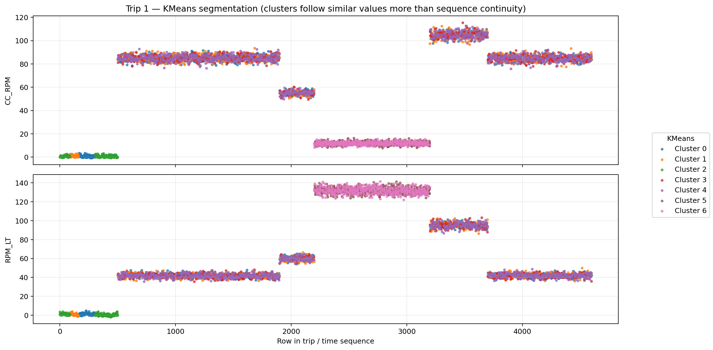
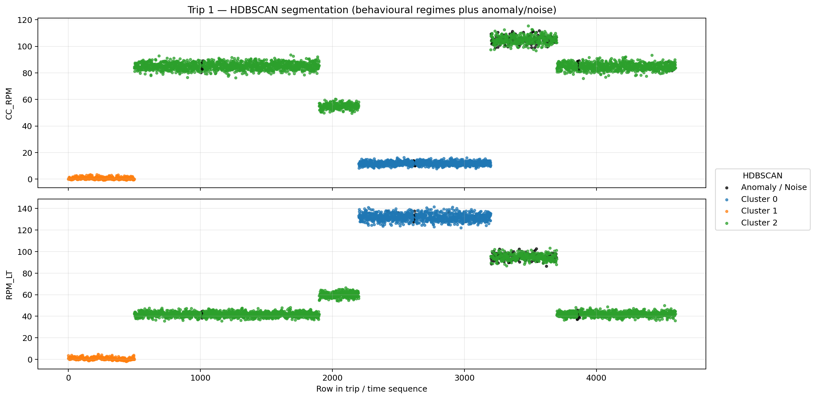

# Multivariate Time-Series Behaviour Segmentation

**Telman Maghrebi**<br>
Senior Data Scientist<br>
Contact: telman_mgh@yahoo.com

## Overview

This project is a proof of concept for identifying behavioural and operational regimes in multivariate time-series sensor data using two unsupervised clustering methods:

1. **KMeans**
2. **HDBSCAN**

The repository is designed as a **public demo version** of the workflow. It uses a **synthetic multi-trip dataset** that mimics multivariate sensor behaviour across different operational regimes. The synthetic data allows users to run the full pipeline end to end without access to private industrial data.

The main objective is to segment time-series trip data into meaningful behavioural regimes using accelerometr, magnetometre, gyroscope, pipe-rotation, flow-induced rotation, shock, vibration, spatial, temporal, and related operational sensor measurements.

The resulting regime labels can support:

- Behaviour segmentation
- Operating-state identification
- Noise and anomaly isolation
- Regime-specific denoising
- Control-engineering decisions
- Trip-level behavioural comparison
- Downstream machine-learning workflows

---

## Problem Statement

Industrial time-series data often contains multiple operating behaviours within the same trip or sequence.

A single trip may include:

- Stationary intervals
- Stable rotation
- High rotation
- Flow-dominant behaviour
- Sliding or transitional behaviour
- High-vibration intervals
- Irregular disturbance or anomaly periods

If the entire trip is treated as a single homogeneous signal, these regimes become mixed together. That makes denoising, monitoring, filtering, and control logic less effective.

This project aims to segment each trip into more coherent behavioural regimes so that downstream analysis can operate on more consistent sections of data.

---

## Public Demo Dataset

This repository includes a **synthetic demonstration dataset** located in:

```text
data/demo/time_series_jobs/
```

The demo dataset contains **four synthetic trip recordings** with the same schema expected by the pipeline.

Each trip contains multivariate time-series signals representing:

- Triaxial accelerometer measurements
- Triaxial magnetometer measurements
- Rotational measurements
- Pipe rotation
- Flow-induced rotation
- Shock and vibration
- Depth and orientation-related fields

The synthetic dataset was intentionally designed to contain several operating regimes, plus short anomaly/disturbance periods, so that clustering behaviour can be visually inspected and compared.

---

## Project Workflow

```text
Synthetic demo CSV files
            ↓
Prepared Parquet feature dataset
            ↓
Dataset validation
            ↓
Feature selection
            ↓
Finite-value row selection
            ↓
Robust quantile clipping
            ↓
Standard scaling
            ↓
KMeans clustering
            ↓
HDBSCAN clustering
            ↓
Behavioural-regime comparison
            ↓
Static and interactive visualisation
```

The pipeline first converts the synthetic CSV files into a prepared Parquet dataset, and then runs both clustering methods on the same selected feature matrix.

---

## Prepared Dataset

The prepared Parquet dataset is written to:

```text
data/prepared/trip_features.parquet
```

It contains:

- Four trip recordings
- Time and depth sequence information
- Sensor and operational features
- A trip identifier
- A row index within each trip
- Raw horizontal-orientation estimates
- Circular orientation-difference features

The validation and loading logic is implemented in:

```text
src/prepared_data.py
```

---

## Sensor and Operational Features

### Triaxial Acceleration

The acceleration channels are:

```text
gx
gy
gz
```

They help describe:

- Motion intensity
- Vibration behaviour
- Directional changes
- Mechanical response patterns

### Triaxial Magnetic Field

The magnetic-field channels are:

```text
bx
by
bz
```

They help describe:

- Magnetic orientation behaviour
- Horizontal-orientation changes
- Rotational state differences
- Disturbance patterns

### Rotational Channels

The rotational channels include:

```text
rx
ry
```

These help identify:

- Rotational transitions
- Stable and unstable operating regimes
- Sequence-specific dynamic behaviour

### Pipe Rotation

The main pipe-rotation channel is:

```text
pipe_rotation
```

It helps identify:

- Stationary periods
- Low-rotation behaviour
- High-rotation behaviour
- Rotational transitions

### Flow-Induced Rotation

The prepared dataset contains:

```text
flow_rotation_lower
flow_rotation_upper
```

These measurements help distinguish:

- Flow-driven regimes
- Mechanical rotation from flow-driven rotation
- Stable versus unstable flow behaviour

### Shock and Vibration

The available features include:

```text
axial_shock_peak
axial_shock_rms
radial_shock_peak
radial_shock_rms
```

These help identify:

- High-impact events
- Sustained vibration
- Mechanical instability
- Potential disturbance or anomaly intervals

### Depth and Orientation

The prepared dataset also contains depth- and orientation-related fields, including:

```text
depth
ground_depth
cont_vertical_orientation_incl
cont_horizontal_orientation
static_vertical_orientation_incl
static_horizontal_orientation
ground_vertical_orientation
ground_horizontal_orientation
azim_raw
horizontal_orientation_abs_difference
```

These provide spatial and directional context for each trip.

---

## Default Clustering Features

By default, both clustering algorithms use the same feature set:

```text
gx
gy
gz
bx
by
bz
rx
ry
pipe_rotation
flow_rotation_lower
flow_rotation_upper
```

Using the same selected rows and scaled feature matrix makes the comparison between KMeans and HDBSCAN more consistent.

---

## Shared Feature Preparation

The modelling pipeline performs the following shared preparation steps:

1. Confirms that the selected features exist
2. Converts selected features to numeric values
3. Replaces infinite values with missing values
4. Excludes rows that are missing any selected feature
5. Clips extreme values using feature-level quantiles
6. Standardises the selected features using `StandardScaler`

The workflow intentionally performs **no**:

- Linear interpolation
- Forward filling
- Backward filling
- Median imputation
- Synthetic filling of missing values during clustering

This helps preserve the original behaviour of the dataset seen by the clustering algorithms.

---

## KMeans

KMeans is a centroid-based clustering algorithm.

It partitions the feature space into a predefined number of clusters by minimising the within-cluster distance to cluster centroids.

### Main Parameters

- `n_clusters`
- `max_iter`
- `tolerance`
- `random_state`
- `outlier_quantile`

### Strengths

- Fast
- Easy to reproduce
- Strong baseline clustering method
- Useful when clusters are compact and roughly separable

### Limitations

- Requires the number of clusters to be chosen in advance
- Assigns every point to a cluster
- Does not natively produce a noise class
- Assumes roughly compact centroid-based structure
- Does not model temporal continuity or sequence order

---

## Why KMeans Struggles on Behavioural Time-Series Segmentation

KMeans works in **feature space**, not in **time-sequence space**.

This means it groups rows that have similar values, even if they come from very different positions in the trip. For behavioural time-series segmentation, this creates an important limitation:

- KMeans does **not** know whether two points are adjacent in time
- KMeans does **not** explicitly preserve contiguous behavioural segments
- KMeans may split one real behavioural regime into several clusters if the values vary in magnitude
- KMeans may merge time-distant observations into the same cluster simply because their feature values are numerically similar

In other words, KMeans tends to divide the trip according to **instantaneous value similarity**, not according to **continuous behavioural segments**.

For sequence segmentation, this often leads to:

- Rapid switching between cluster labels
- Fragmented segments
- Limited temporal coherence
- Poor anomaly isolation
- Clusters that reflect amplitude differences more than regime continuity

### Example from the Synthetic Trip 1

For one synthetic trip, the clustering outputs showed:

- **KMeans cluster-label transitions:** `3,108`
- **HDBSCAN cluster-label transitions:** `263`

This large difference illustrates that KMeans creates much more fragmented sequence labelling, while HDBSCAN tends to recover more coherent behavioural regimes with clearer segment continuity.

---

## HDBSCAN

HDBSCAN is a density-based clustering algorithm.

It identifies stable dense regions in the feature space and can leave sparse or unstable observations unassigned.

Native HDBSCAN noise observations use the label:

```text
-1
```

The dashboard displays this label as:

```text
Anomaly / Noise
```

### Main Parameters

- `min_cluster_size`
- `min_samples`
- `metric`
- `cluster_selection_method`
- `cluster_selection_epsilon`
- `target_total_labels`

### Strengths

- Does not require a fixed native number of clusters
- Can represent irregular cluster shapes
- Naturally identifies noise
- More suitable for behavioural regimes with different local densities
- Often gives more coherent regime segmentation than KMeans

### Limitations

- Sensitive to hyperparameter selection
- Can classify many points as noise
- Results still require engineering interpretation
- Displayed cluster count in the dashboard may involve merging or splitting for comparison purposes

---

## Trip 1 Example — KMeans vs HDBSCAN

The following example uses **Trip 1** from the synthetic demo dataset.

### KMeans on Trip 1

KMeans tends to mix colours across long stretches of similar operating values. This indicates that it is largely clustering rows by **value similarity**, not by **continuous behavioural segments**.



### HDBSCAN on Trip 1

HDBSCAN produces fewer, more coherent behavioural regions and also isolates sparse or unstable observations as **Anomaly / Noise**.



### Technical Observation

For behavioural time-series segmentation, HDBSCAN is often more suitable than KMeans because:

- it can model different density regimes
- it preserves a natural noise class
- it tends to create more contiguous behavioural segments
- it is less likely to fragment the trip purely based on value differences

KMeans remains useful as a fast baseline, but it should not be assumed to represent true sequence-level behavioural segmentation.

---

## Project Structure

```text
clustering_time_series_data/
│
├── data/
│   ├── demo/
│   │   ├── .gitkeep
│   │   └── time_series_jobs/
│   │       ├── time_series_job1.csv
│   │       ├── time_series_job2.csv
│   │       ├── time_series_job3.csv
│   │       └── time_series_job4.csv
│   ├── prepared/
│   │   └── .gitkeep
│   └── processed/
│       └── .gitkeep
│
├── docs/
│   └── images/
│       ├── trip1_kmeans_segmentation.png
│       └── trip1_hdbscan_segmentation.png
│
├── outputs/
│   └── .gitkeep
│
├── src/
│   ├── prepare_parquet.py
│   ├── prepared_data.py
│   ├── cluster_time_series_methods.py
│   ├── plot_kmeans_hdbscan_time_series.py
│   └── dash_cluster_app.py
│
├── .gitignore
├── LICENSE
├── README.md
└── requirements.txt
```

---

## Main Python Modules

### `prepare_parquet.py`

Creates the prepared Parquet dataset from the synthetic demo CSV files.

It:

- Combines the four trip recordings
- Standardises and renames fields
- Converts expected numeric features
- Shifts timestamps to a common reference date
- Calculates raw horizontal orientation
- Calculates circular orientation differences
- Adds trip and within-trip sequence identifiers
- Writes the prepared Parquet file

### `prepared_data.py`

Provides reusable prepared-data loading and validation.

It:

- Loads the Parquet dataset
- Validates required fields
- Parses datetime fields
- Sorts rows by trip and sequence
- Returns available numeric clustering features
- Defines the default clustering inputs

### `cluster_time_series_methods.py`

Runs the main clustering workflow.

It:

- Loads the prepared Parquet dataset
- Creates the shared feature matrix
- Runs KMeans
- Runs HDBSCAN
- Creates summary outputs
- Saves processed datasets and reports

### `plot_kmeans_hdbscan_time_series.py`

Creates static comparison figures for both methods.

It supports:

- One selected trip or all trips
- Configurable x-axis
- Configurable plotted features
- Point downsampling
- PNG output

### `dash_cluster_app.py`

Provides the interactive Dash application.

It supports:

- Side-by-side KMeans and HDBSCAN plots
- Trip filtering
- X-axis selection
- Model feature selection
- Plot feature selection
- KMeans hyperparameter tuning
- HDBSCAN hyperparameter tuning
- Cluster filtering
- Summary tables
- Anomaly/noise highlighting
- Interactive model reruns

---

## Installation

Create and activate a virtual environment.

On Windows PowerShell:

```powershell
python -m venv .venv
.\.venv\Scripts\Activate.ps1
```

Install dependencies:

```powershell
python -m pip install -r requirements.txt
```

Main dependencies:

- NumPy
- pandas
- Matplotlib
- scikit-learn
- Plotly
- Dash
- PyArrow

---

## Prepare the Parquet Dataset

The demo CSV files are already included in:

```text
data/demo/time_series_jobs/
```

Run:

```powershell
python src\prepare_parquet.py
```

This creates:

```text
data/prepared/trip_features.parquet
```

---

## Validate the Prepared Dataset

Run:

```powershell
python src\prepared_data.py
```

This prints:

- Dataset shape
- Trip identifiers
- Default clustering features
- Available numeric features
- Sampling coverage

---

## Run the Clustering Pipeline

Run:

```powershell
python src\cluster_time_series_methods.py
```

This generates:

```text
data/processed/kmeans_clustered_trip_features.parquet
data/processed/hdbscan_clustered_trip_features.parquet
outputs/kmeans_cluster_summary.csv
outputs/hdbscan_cluster_summary.csv
outputs/clustering_method_comparison.csv
```

---

## Generate Static Figures

Generate figures for all trips:

```powershell
python src\plot_kmeans_hdbscan_time_series.py
```

Generate figures for one trip:

```powershell
python src\plot_kmeans_hdbscan_time_series.py --trip 1
```

Use a different x-axis:

```powershell
python src\plot_kmeans_hdbscan_time_series.py --trip 1 --x-axis time
```

Use specific features:

```powershell
python src\plot_kmeans_hdbscan_time_series.py --trip 1 --features gx gy gz pipe_rotation
```

Figures are saved under:

```text
outputs/figures/
```

---

## Launch the Dashboard

Run:

```powershell
python src\dash_cluster_app.py
```

Then open:

```text
http://127.0.0.1:8050/
```

The dashboard initially runs both clustering methods using the default features and parameters.

You can then rerun the models interactively using different:

- Feature selections
- KMeans cluster counts
- KMeans convergence settings
- KMeans outlier thresholds
- HDBSCAN density settings
- HDBSCAN distance metrics
- HDBSCAN cluster-selection settings
- Displayed regime counts

---

## Real-Time Extension

A possible real-time extension is to use the inferred behavioural regime as an additional processing or control signal.

A simplified online workflow would be:

1. Receive the latest sensor observation or time window
2. Apply the same feature definitions used during training
3. Apply the same clipping and scaling rules
4. Assign the observation to a regime
5. Apply regime-specific filtering, diagnostics, or control logic

Potential applications include:

- Smoother filtering in stable regimes
- Stronger suppression in high-vibration regimes
- Transition-specific logic
- Separate handling of anomaly/noise rows
- Regime-aware downstream modelling

This repository is still a proof of concept and does not yet implement a production online inference service.

---

## License

This project is licensed under the MIT License. See the `LICENSE` file for details.
